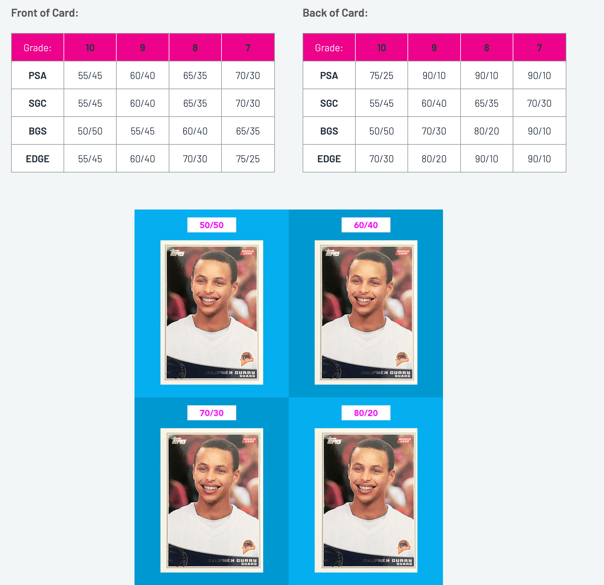

Starting in 1984 when Accugrade Sportscard Authentication (ASA) introduced the process of grading sports cards centering has been an important factor in the final grade of every card authenticated and slabbed ever since. Nearly all grading companies use a 1-10 scale for the condition of cards and have a fairly strict set of guidelines for what is inspected on the surface, edges, and corners of a card as well as how the centering measurements of a card's borders affect the final grade. Uniform borders give cards better eye appeal and, in turn, are worth more to collectors.

How is card centering calculated?
Centering measurements are represented as a percentage. If the left border and right border of a card both measure 3mm in thickness then that card would be said to have 50/50 left/right centering since each border takes up 50% of the total left/right border measurement.

Centering is measured in 4 places on each card: The front left/right and top/bottom as well as the back left/right and top/bottom.

Border locations
To calculate the front right/left centering of a card, as an example, measure the width of the front left border and the width of the front right border. Let's say the left border comes out to 3mm and the right border to 2mm. That gives us a total left/right (L/R) border of 3mm + 2mm = 5mm. To calculate the percentages we can divide each border into the total border width. For the left side 3mm/5mm = .6 (60%). On the right 2mm/5mm = .4 (40%).

Now we could calculate the front top/bottom centering to get an idea of our overall front centering score. Let's say the top/bottom is 50/50. For most grading companies the lower score of the 2 border areas (Left/Right, Top/Bottom) is used - which in this case would be the left/right measurement of 60/40 - so this card would have 60/40 front centering.

60/40 centering example card
What centering percentages does a card require to be graded a 10?
Centering specifications vary between grading companies. Professional Sports Authenticator (PSA) was the most lenient for decades, allowing 60/40 centering on the front and 75/25 on the back for a Gem Mint 10. The PSA Grading Standards changed in early 2025, however, and a Gem Mint 10 now requires 55/45 front centering and 75/25 back centering. Beckett Grading Services (BGS) is the most strict - requiring 50/50 on both the front and back to be eligible for a grade of 10*. Sports Card Guarantee (SGC) and Edge Grading are somewhere in the middle with SGC being very strict on the backs of cards (55/45 front and back) and Edge being very loose with the centering requirements for card backs (55/45 front, 70/30 back).

*As a caveat, BGS uses 9.5 as its Gem Mint grade. Getting a grade of 10 at BGS is considered above and beyond, similar to SGCs 10 Pristine (which also requires 50/50 on both the front and back) and Edge's Ultramint 10+ (which requires 52/48 on the front and 60/40 on the back).

